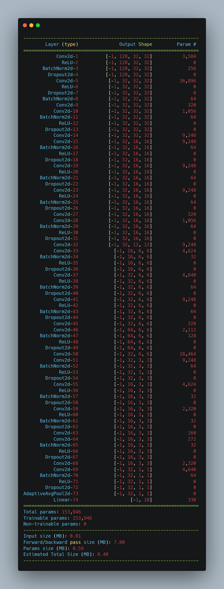
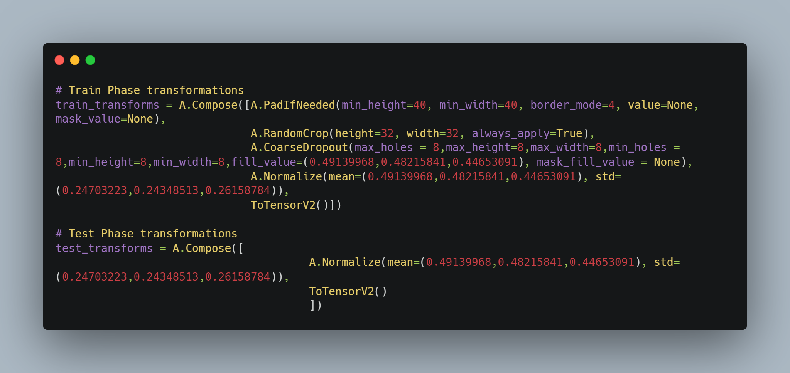
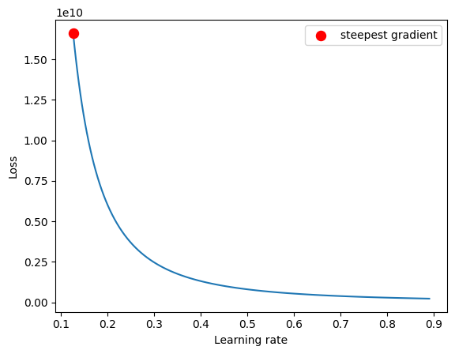
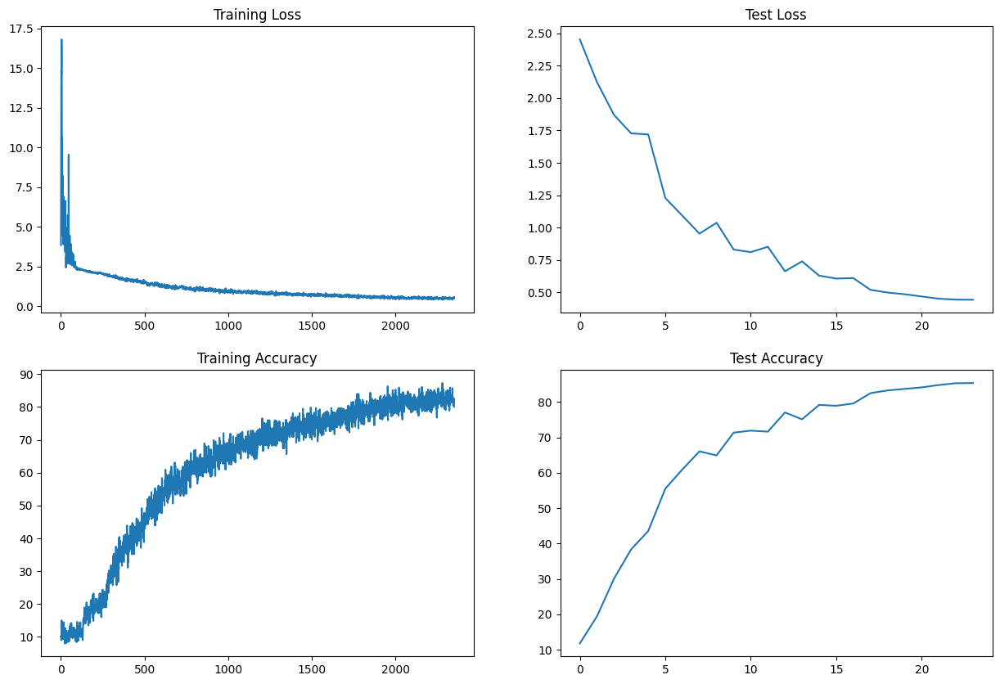

# Custom ResNet for CIFAR10

This document outlines a custom ResNet architecture designed specifically for the CIFAR10 dataset. The goal is to achieve at least 90% accuracy using a tailored training regimen and data augmentation strategies.

## Model Architecture

### PrepLayer
- **Convolution**: 3x3 kernel, stride 1, padding 1, 64 output channels
- **Batch Normalization**
- **ReLU Activation**

### Layer 1
- **X**: Convolution (3x3 kernel, stride 1, padding 1, 128 output channels) -> MaxPooling (2D) -> Batch Normalization -> ReLU Activation
- **R1**: ResBlock applying the following twice: Convolution (same specs as X) -> Batch Normalization -> ReLU Activation
- **Operation**: Add(X, R1)

### Layer 2
- **Convolution**: 3x3 kernel, 256 output channels
- **MaxPooling2D**
- **Batch Normalization**
- **ReLU Activation**

### Layer 3
- **X**: Convolution (3x3 kernel, stride 1, padding 1, 512 output channels) -> MaxPooling (2D) -> Batch Normalization -> ReLU Activation
- **R2**: ResBlock applying the following twice: Convolution (same specs as X) -> Batch Normalization -> ReLU Activation
- **Operation**: Add(X, R2) -> MaxPooling with Kernel Size 4

### Final Layers
- **Global Average Pooling** (Adaptive to 1x1)
- **Fully Connected Layer**: Output size 10 (number of classes in CIFAR10)
- **SoftMax Activation**

## Training Regimen

- **Optimizer**: ADAM
- **Loss Function**: CrossEntropyLoss
- **Batch Size**: 512
- **Total Epochs**: 24
- **One Cycle Policy**:
  - Max at Epoch: 5
  - LRMIN and LRMAX to be determined based on LR Range Test
  - No Annihilation

## Data Augmentation

- **RandomCrop**: 32x32 (after padding of 4)
- **FlipLR**: Horizontal Flip
- **CutOut**: 8x8

## Goal

- **Target Accuracy**: 90%

## Implementation Notes

- The learning rates (LRMIN and LRMAX) should be determined using an LR Range Test before the actual training to find the optimal learning rates.
- The architecture described assumes CIFAR10's input dimensions (32x32 images with 3 channels).
- It is crucial to monitor the training process for signs of overfitting and adjust the dropout rate or augmentation strategies as necessary.

## Analysis 
The Architecture: 

Data Augmentation:

### 1. One Cycle Policy
There are two Models like `trial_model` and `model`. Out of which `trial_model` is used to find the learning rates (LRMIN and LRMAX).
By using the learning Rate Finder we have find the LRMAX = 1.26E-01
By using the learning Rate Finder we have find the LRMIN = 0.0126

1. **trial_model**
`criterion = nn.CrossEntropyLoss()`
`optimizer = optim.Adam(trial_model.parameters(), lr=0.1, weight_decay=1e-2)`
`lr_finder = LRFinder(trial_model, optimizer, criterion, device="cuda")`
`lr_finder.range_test(trainloader, val_loader=testloader, end_lr=1, num_iter=100, step_mode="exp")`
`lr_finder.plot(log_lr=False)`
`lr_finder.reset()`

2. **Model**
`model =  Custom_Resnet().to(device) `
`trainer = Trainer(model,device,trainloader,testloader,lr_max=1.26E-01,lr_min=0.0126,epochs=24,max_at_epoch=5)`
`trainer.run()`
**Achieve Accuracy** : 
A. Train : 80%
B. Test : 85%

